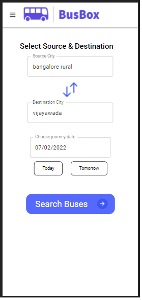
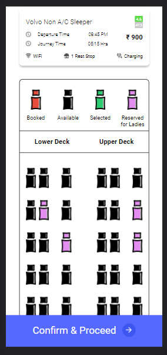
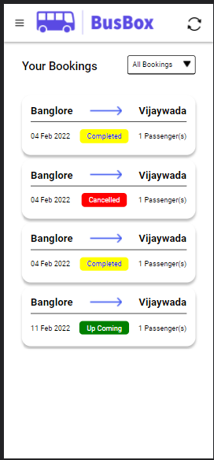

# BUSBOX - A Simple Bus Ticket Booking System

This is the Backend Implementation of simple Bus Ticket Booking System (BusBox). It is built on the MERN stack.


## License

[MIT](LICENCE)


## Environment Variables

To run this project, you will need to add the following environment variables to your .env file

`ACCESS_TOKEN_SECRET`

`REFRESH_TOKEN_SECRET`

`DATABASE_URI`

`STRIPE_SECRETE_API_KEY`

`SERVER_URL`

`FRONTEND_URL`

`NODE_MAILER_EMAIL`

`NODE_MAILER_PASSWORD`

`GOOGLE_CLIENT_ID`

## Run Locally

Clone the project

```bash
  git clone https://github.com/pesto-students/busbox-be-n12-gamma2.git
```

Go to the project directory

```bash
  cd busbox-be-n12-gamma2
```

Install dependencies

```bash
  npm install
```

Start the server

```bash
  npm run start
```


## API Reference

You can find detailed documentation and information of each and every API this server provides in [API-DOCS](API-DOCS.pdf) file in this repo. 

## Roadmap

- Integrate grafana to have server logs

- Create separate microservice for redis & implement caching

- Have a custom domain name to deploy the app
## 🚀 About Me
I'm a full stack developer... I am always eager to learn new things, or have peer coding session, or to just chill with other dev buddies.
Feel free to contact me on my [Linked In](). Or drop me an [email](patilgajanan1807@gmail.com)

## 🛠 Skills
Nodejs, ReactJS, Javascript, Haskell, Java, Purescript, HTML, CSS...


## Screenshots








## Tech Stack

**Client:** React, Redux

**Server:** Node, Express, MongoDB, Redis


## Contributing

Contributions are always welcome!

If you have a neat fix for a bug you are facing, Or an amazing new feature to add, Fork from this repository and send a pull request, I will try my best to review and merge it ASAP.

Please adhere to this project's `code of conduct`.


## FAQ

#### Do I have to make actual payment on stripe's payment page ?

No, currently it is integrated using test credentials, You can use test card (4242 4242 4242 4242) with future expiry date and any 3 digit cvv to make a successful booking.

